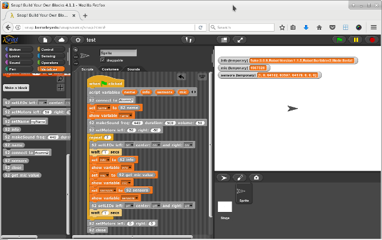

Scribbler2-Python
=================

Librería Python para controlar a través de bluetooth el robot Scribbler2 (S2 - www.parallax.com) y la tarjeta Fluke2 (F2 - www.betterbots.com).

* Implementa todas las funciones del S2 (Firmware IPRE)
* Implementa la mayoría de las funciones de la tarjeta F2

Importante:
* la tarjeta Fluke2 centraliza la recepción de todos los comando y maneja un timeout de 3000ms lo que puede generar problemas de sincronimos en operaciones que tarden más de ese tiempo.
* En Linux si `/usr/sbin/ModemManager`está en ejecución bloqueará el acceso al robot por lo cual es necesario detener el proceso (`sudo systemctl stop ModemManager`)

## Instalación
La librería está para ser utilizada desde Python2.7 o Python3.x y requiere tener instalado el módulo `serial`

Su instalación se realiza en dos pasos
1. Clonar o descargar el ZIP desde [GitHub](https://github.com/titos-carrasco/Scribbler2-Python)
2. Desde el directorio raíz del software ejecutar `pip install .`

## Demos/
* F2Inner.py: prueba de los elementos internos de la Fluke2
* F2IRSensors.py: prueba de los sensores infrarojos de la Fluke2
* F2LEDs.py: prueba de los LEDs de la Fluke2
* F2Servos.py: prueba de los motores servo de la Fluke2
* S2Inner.py: prueba de los elementos internos del Scribbler2
* S2IRSensors.py:prueba de los sensores infrarojos del Scribbler2
* S2LEDs.py: prueba de los LEDs del Scribbler2
* S2LightSensors.py: prueba de los sensores de luz del Scribbler2
* S2LineSensors.py: prueba de los sensores de línea del Scribbler2
* S2Microphone.py: prueba del micrófono del Scribbler2
* S2Motors.py: prueba de los motores del Scribbler2
* S2Path.py: movimiento en el plano cartesiano (tener presente el timeout) del Scribbler2
* S2Speaker.py: generación de sonido en el Scribbler2
* XTRA_F2Camera.py: prueba de la camara de la Fluke2. Requiere que se instale `numpy` y `opencv`
* XTRA_S2Joystick.py: prueba para comandar el robot via joystick e interfaz gráfica
* XTRA_S2MidiController.py: prueba para comandar el robot utilizando un controlador MIDI. Requiere `pyrtmidi`
* XTRA_S2MQTT.py: prueba para controlar el robot a través de un broker MQTT:
  * `mosquitto_pub -h test.mosquitto.org -t rcr/S2 -m "left 5"`
  * Se puede utilizar la app [VoiceAndMQTT](https://github.com/titos-carrasco/VoiceAndMQTT) para enviar órdenes verbales
* XTRA_S2SnapExtension.py: Extensión para controlar el Scribbler 2 desde SNAP:
  * Ejecutar este archivo, lo que habilitará un servidor en la puerta 1963
  * Acceder desde un navegador a la dirección http://localhost:1963/ y hacer un clic en la opción `Download Snap! blocks` lo que descargará el archivo`snap_S2Robot.xml` que correponde a la definición requerida por SNAP
  * Acceder a [SNAP](http://snap.berkeley.edu/snapsource/snap.html) utilizando  HTTP (la extensión no soporta HTTPS)
  * Seleccionar la opción `import` del primer icono en la parte superior izquierda y seleccional el archivo XML anterior

## Desarrollo
Todo el desarrollo se realiza utilizando Geany en Linux Debian, configurando un proyecto y asociando comandos en Set Build Commands:

* Para compilar en Python: python -m py_compile "%f"
* Para ejecutar Python: python "%f"

El código es revisado con `pydocstyle` y la documentación generada con`$ epydoc -v --html  -o doc/ *.py rcr/`

